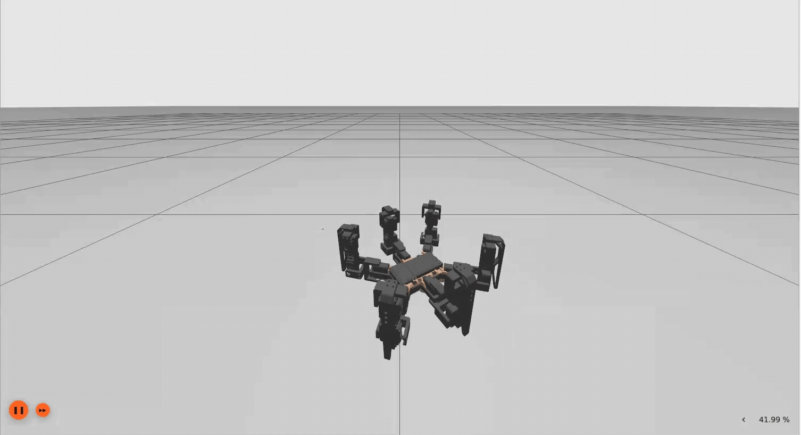

# ROS2 Hexapod Gazebo

<div align="center">
    
</div>

This repository contains a ROS2 launch file to load the robot on Gazebo and control it.

For a complete overview of the project refer to the [main Hexapod repository](https://github.com/ggldnl/Hexapod.git).

## 🛠️ Setup

Prerequisite: having Gazebo and some other packages installed:

```bash
sudo apt update
sudo apt install ros-<your-distro>-ros-gz-sim
sudo apt install ros-<your-distro>-ros-gz-bridge
sudo apt install ros-<your-distro>-joint-state-broadcaster
sudo apt install ros-<your-distro>-ros2-control
sudo apt install ros-<your-distro>-ros2-controllers
sudo apt install ros-<your-distro>-forward-command-controller
```

### Clone the repo

Clone the repo. For simplicity, I will assume the ROS workspace is in the `home` folder. 
A ROS best practice is to put any packages in the workspace into the `src` directory.

```bash
cd ~/ros_ws/src  # use your actual ROS workspace
git clone --recurse-submodules https://github.com/ggldnl/Hexapod-Gazebo.git
```

### Build the package 

```bash
cd ~/ros_ws
colcon build --packages-select hexapod_gazebo
source install/setup.bash
```

## 🚀 Delpoy

- Launch the [controller node](https://github.com/ggldnl/Hexapod-ROS-Python.git) on the hexapod. The board runs the whole control loop; the node provisions it at startup, stands it up, then streams your setpoints (`/hexapod/cmd_vel`, `/hexapod/cmd_pose`, ...) and republishes telemetry (`/hexapod/odom`, `/hexapod/joint_values`, ...). Gazebo mirrors the streamed joint values, so it shows exactly what the real robot is doing.
  ```bash
  ros2 run hexapod_controller hexapod_controller
  ```

- Launch the simulation:
  ```bash
  ros2 launch hexapod_gazebo gazebo.launch.py
  ```

The launch file will:
  - Start Gazebo simulator
  - Spawn the robot
  - Activate the forward_command_controller and joint_state_broadcaster
  - Start a bridge node listening on /hexapod/joint_values to update the simulation
  - Start a node listening to Joy messages to produce /hexapod/cmd_vel_norm and /hexapod/cmd_height messages

> Note: the robot boots in the OFF state and folded on the ground. Stand it up explicitly with the stand-up button (or `ros2 topic pub /hexapod/enable std_msgs/msg/Bool "{data: true}" --once`), and fold it back down with the sit-down button (`{data: false}`). The controller node streams heartbeats continuously; if those heartbeats stop, the board sits back down and goes OFF on its own.

You can check controller status with:
```bash
ros2 control list_controllers
```

## 🎛 Controlling the hexapod manually

Note: commands are fire-and-forget.

- Move forward at 100 mm/s. `/hexapod/cmd_vel` is in SI units (m/s, rad/s), so 100 mm/s is `0.1`:
  ```bash
  ros2 topic pub /hexapod/cmd_vel geometry_msgs/msg/Twist "{linear: {x: 0.1, y: 0.0, z: 0.0}, angular: {z: 0.0}}" --once
  ```

- Change body pose:
  ```bash
  ros2 topic pub /hexapod/cmd_pose geometry_msgs/msg/Pose "{position: {x: 0.0, y: 0.0, z: 0.0}, orientation: {x: 0.0, y: 0.0, z: 0.0871557, w: 0.9961947}}" --once
  ```
  If you need a specific roll/pitch/yaw, convert to quaternion first (ROS uses quaternions, not Euler angles).  

## 🕹️ Controlling the Hexapod with a controller

### Using standard nodes

This is not the intended way to control the Hexapod. Skip to [the next section](README.md#using-my-custom-node).

- Launch `joy_node` on your machine. You can use `ls /dev/input/js*` to know the device id.
  ```bash
  ros2 run joy joy_node --ros-args -p device_id:=0 
  ```

- Launch `teleop_twist_joy` on your machine. Adapt this command to match your controller. You can launch the node with no arguments and listen to `/joy` to know what button does what. The `-r` argument repams `/cmd_vel` to `/hexapod/cmd_vel_norm`. The `norm` variant of this command accepts messages with normalized velocity (range -1, 1); you can publish actual velocities on `/hexapod/cmd_vel` instead. 
  ```bash
  # left joystick axis 1 for backward/forward movement
  # left joystick axis 0 for right/left movement
  # right joystick axis 3 for yaw rotation
  
  ros2 run teleop_twist_joy teleop_node \
    --ros-args \
    -p axis_linear.x:=1 \
    -p axis_linear.y:=0 \
    -p axis_angular.yaw:=3 \
    -p enable_button:=5 \
    -p scale_linear.x:=1.0 \
    -p scale_linear.y:=1.0 \
    -p scale_angular.yaw:=1.0 \
    -r /cmd_vel:=/hexapod/cmd_vel_norm
  ```

  Mine was an old PS3 controller. You can check the mapping for your controller with:
  ```bash
  ros2 topic echo /joy
  ```

### Using my custom node

The Gazebo launch file also launches a custom node that should allow for better interaction with the hexapod. Using `teleop_twist_joy` we are bound to produce only `/cmd_vel` commands (mapped to `/hexapod/cmd_vel_norm`) but we might also want to control the body pose or the robot lifecycle on different topics. The custom node provides a way to do this. Its button map (edit the constants at the top of `joy_teleop_node.py` to match your controller):

  - Stand up (enable): button 3
  - Sit down (shutdown): button 0
  - Hold to move (deadman): button 5, velocity is only sent while this is held
  - Body height up / down: buttons 6 / 7
  - Right stick: body pitch / yaw while the deadman is released, walking yaw rate while it is held

Stand the robot up first, then hold the deadman and use the sticks to walk. If you don't want to use Gazebo and you are interested only into controlling the Hexapod with a controller, you can launch the node by itself:

```
ros2 launch hexapod_gazebo joy_teleop.launch.py joy_device_id:=0
```

## 🤝 Contribution

Feel free to contribute by opening issues or submitting pull requests. For further information, check out the [main Hexapod repository](https://github.com/ggldnl/Hexapod). Give a ⭐️ to this project if you liked the content.